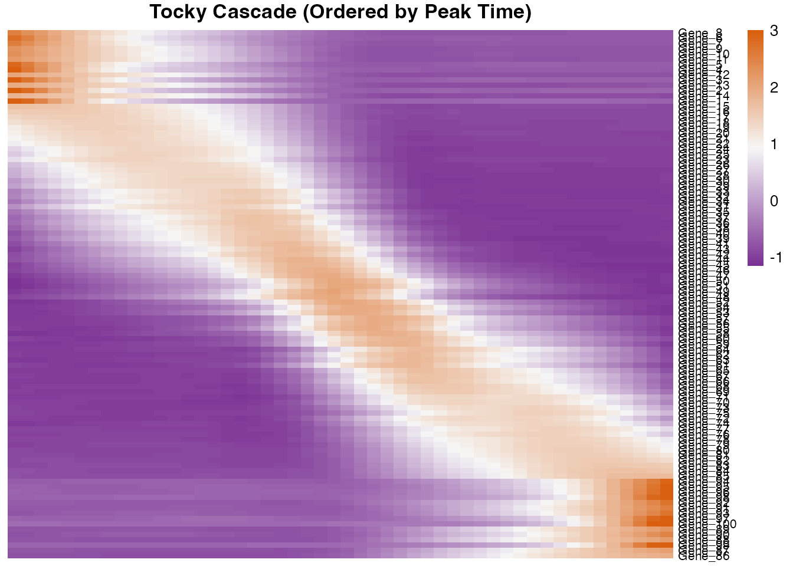

# Advanced Dynamics and Temporal Cascades

## Introduction

Once the **Canonical Tocky Manifold** is constructed and cells are
assigned a precise continuous coordinate (Tocky Time), the next crucial
step is determining which genes significantly alter their expression
along this developmental trajectory.

This vignette demonstrates how to use `RunTradeSeqTocky` to fit
Generalized Additive Models (GAMs) and `PlotTockyHeatmap` to identify
transcriptional cascades.

## 1. Establishing the Base Manifold

To demonstrate the power of `CanonicalTockySeq` and `tradeSeq`, we will
simulate a dataset with a true underlying biological structure: \* 100
genes are simulated to peak sequentially along the developmental
trajectory. \* We simulate a biological knockout (KO) where cells have a
50% reduction in expressing the ‘Late’ stage genes compared to Wild-Type
(WT).

``` r
set.seed(2026)
n_genes <- 500
n_cells <- 300

# 1. Assign true developmental time and groups to cells
true_time <- runif(n_cells, 0, pi/2)
cell_groups <- sample(c("WT", "KO"), n_cells, replace = TRUE)
names(cell_groups) <- paste0("Cell_", 1:n_cells)

# 2. Engineer Continuous Temporal Cascades for Top 100 Genes
# We use a Gaussian function so each gene peaks sequentially along the trajectory
gene_peaks <- seq(0, pi/2, length.out = 100)
X_signal <- matrix(0, nrow = 100, ncol = n_cells)
for(i in 1:100) {
  X_signal[i, ] <- exp( - (true_time - gene_peaks[i])^2 / 0.1) * 20
}

# Add 400 random noise genes
X_noise <- matrix(runif(400 * n_cells, 0, 2), nrow = 400, ncol = n_cells)
X_base <- rbind(X_signal, X_noise)

# Simulate a biological knockout effect: KO cells fail to fully upregulate 'Late' genes
ko_idx <- which(cell_groups == "KO")
X_base[70:100, ko_idx] <- X_base[70:100, ko_idx] * 0.5

# Format as non-negative counts for tradeSeq
X <- round(X_base + matrix(rnorm(n_genes * n_cells, sd = 1), nrow = n_genes))
X[X < 0] <- 0
colnames(X) <- names(cell_groups)
rownames(X) <- paste0("Gene_", 1:n_genes)

# 3. Create Gene Constraints (Z) matching the biological landmarks
# Blue (New) peaks at t=0, BlueRed (Persistent) at t=pi/4, Red (Arrested) at t=pi/2
all_gene_peaks <- c(gene_peaks, runif(400, 0, pi/2))
Z <- matrix(0, nrow = n_genes, ncol = 3)
colnames(Z) <- c("Blue", "BlueRed", "Red")
rownames(Z) <- rownames(X)

Z[, "Blue"]    <- exp( - (all_gene_peaks - 0)^2 / 0.2 )
Z[, "BlueRed"] <- exp( - (all_gene_peaks - pi/4)^2 / 0.2 )
Z[, "Red"]     <- exp( - (all_gene_peaks - pi/2)^2 / 0.2 )

# 4. Reconstruct Manifold
tocky_res <- CanonicalTockySeq(X = X, Z = Z)
```

    ## Normalization and projection completed... 
    ## Performing fast partial SVD (irlba) for top 3 components...
    ## SVD completed...

``` r
gradient_res <- GradientTockySeq(
  res = tocky_res, 
  B = tocky_res$biplot["Blue",], 
  BR = tocky_res$biplot["BlueRed",], 
  R = tocky_res$biplot["Red",]
)
```

## 2. Rapid Pre-filtering of Dynamic Genes

Fitting GAMs to tens of thousands of genes is computationally intensive.
The `SelectTockyGenes` function provides a rapid linear spline
regression filter to isolate the most dynamically varying genes along
the Tocky Time axis.

``` r
# Select the top 100 most dynamic genes for a highly impressive cascade
dynamic_genes <- SelectTockyGenes(
  expression_data = X, 
  gradient_res = gradient_res, 
  top_n = 100, 
  min_expr = 0.05
)
```

    ##   Initial screen: 500 genes passed expression threshold (5.0%).
    ##   Scoring dynamics for 500 genes...
    ##   Selected top 100 genes.

## 3. Differential Dynamics using tradeSeq

The `RunTradeSeqTocky` wrapper interfaces directly with the `tradeSeq`
package to fit GAMs. It evaluates expression against the 0-90 degree
Tocky Time.

By providing a named vector with two conditions (WT and KO), `tradeSeq`
will test for genes that have significantly different dynamic
trajectories between the two groups.

``` r
# Fit GAMs and perform statistical testing between WT and KO
tradeSeq_res <- RunTradeSeqTocky(
  object = X,
  gradient_res = gradient_res,
  group_by = cell_groups,
  genes = dynamic_genes,
  n_knots = 5,
  n_cores = 1
)
```

    ## Running tradeSeq on 100 genes across 300 cells (2 groups)...

    ## Testing for differential dynamics (Condition Test)...

``` r
# View the differential dynamics results (p-values and FDR)
head(tradeSeq_res$results)
```

    ##          waldStat df       pvalue         padj
    ## Gene_71  97.80592  5 0.000000e+00 0.000000e+00
    ## Gene_73  91.25394  5 0.000000e+00 0.000000e+00
    ## Gene_72  99.79666  5 0.000000e+00 0.000000e+00
    ## Gene_70 120.21078  5 0.000000e+00 0.000000e+00
    ## Gene_74  83.73076  5 1.110223e-16 2.220446e-15
    ## Gene_76  79.41389  5 1.110223e-15 1.850372e-14

## 4. Visualizing the Temporal Cascade

Once significant genes are identified, plotting them in developmental
order reveals the sequential transcriptional logic of your system.

The `PlotTockyHeatmap` function supports ordering genes by their peak
activation timing (“peak”) or via standard hierarchical clustering
(“cluster”). By default, it applies a Z-score row scaling to highlight
expression shifts.

``` r
# Plot the expression cascade, ordered by the peak Tocky Time
PlotTockyHeatmap(
  object = X,
  gradient_res = gradient_res,
  genes = dynamic_genes,
  ordering_method = "peak",
  n_bins = 50,
  span = 0.5
)
```

    ## Binning 300 cells into 50 angular intervals...
    ## Smoothing binned trajectories...



## 5. Biological Interpretation

The heatmap above visualizes the transcriptional cascade along the
Canonical Tocky Manifold. This allows identification of specific
temporal windows, identifying the immediate-early genes that initiate
upon TCR signalling versus the late-stage markers associated with
antigen-experienced states.

- **The X-axis (Tocky Time):** Represents the progression of cells from
  the ‘New’ state to the ‘Arrested’ state, decoupled from the absolute
  signaling intensity.
- **The Y-axis (Genes):** Displays the top 100 most dynamic genes,
  ordered sequentially by their peak expression timing.
