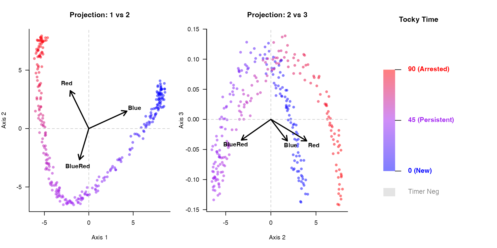
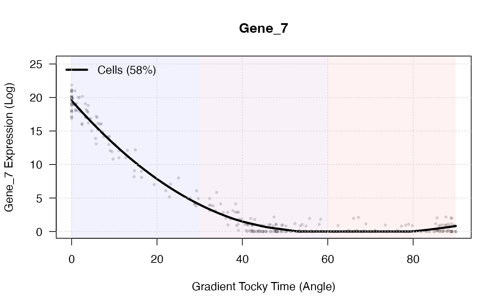

# Getting Started with CanonicalTockySeq

## Introduction

**CanonicalTockySeq** utilizes a supervised Canonical Redundancy
Analysis (RDA) to construct a transcriptomic manifold with conical
geometry. By anchoring single-cell expression data to known
developmental landmarks, it allows researchers to accurately trace
continuous *in vivo* trajectories.

This vignette demonstrates the core workflow: simulating a structured
transcriptomic manifold, generating the canonical space, projecting
cells via piecewise Spherical Linear Interpolation (SLERP), and
visualizing the resulting trajectory.

## 1. Simulating a Transcriptomic Manifold

To demonstrate the workflow, we will generate a synthetic single-cell
dataset with a true underlying biological structure. We engineer
continuous temporal cascades using Gaussian functions so that genes peak
sequentially along a developmental trajectory, mirroring real biological
differentiation.

The `CanonicalTockySeq` function requires two inputs:

- **`X`**: A numeric matrix of gene expression (Genes x Cells).
- **`Z`**: A numeric matrix of explanatory variables (Genes x
  Signatures), representing Tocky-specific landmark signatures.

``` r
set.seed(2026)

n_genes <- 500
n_cells <- 300

# 1. Assign true developmental time to cells
true_time <- runif(n_cells, 0, pi/2)
cell_names <- paste0("Cell_", 1:n_cells)

# 2. Engineer Continuous Temporal Cascades for Top 100 Genes
# We use a Gaussian function so each gene peaks sequentially along the trajectory
gene_peaks <- seq(0, pi/2, length.out = 100)
X_signal <- matrix(0, nrow = 100, ncol = n_cells)
for(i in 1:100) {
  X_signal[i, ] <- exp( - (true_time - gene_peaks[i])^2 / 0.1) * 20
}

# Add 400 random noise genes to mimic background transcription
X_noise <- matrix(runif(400 * n_cells, 0, 2), nrow = 400, ncol = n_cells)
X_base <- rbind(X_signal, X_noise)

# Add statistical noise and format as non-negative counts
X <- round(X_base + matrix(rnorm(n_genes * n_cells, sd = 1), nrow = n_genes))
X[X < 0] <- 0
colnames(X) <- cell_names
rownames(X) <- paste0("Gene_", 1:n_genes)

# 3. Create Gene Constraints (Z) matching the biological landmarks
# Blue (New) peaks at t=0, BlueRed (Persistent) at t=pi/4, Red (Arrested) at t=pi/2
all_gene_peaks <- c(gene_peaks, runif(400, 0, pi/2))
Z <- matrix(0, nrow = n_genes, ncol = 3)
colnames(Z) <- c("Blue", "BlueRed", "Red")
rownames(Z) <- rownames(X)

Z[, "Blue"]    <- exp( - (all_gene_peaks - 0)^2 / 0.2 )
Z[, "BlueRed"] <- exp( - (all_gene_peaks - pi/4)^2 / 0.2 )
Z[, "Red"]     <- exp( - (all_gene_peaks - pi/2)^2 / 0.2 )
```

## 2. Canonical Redundancy Analysis (RDA)

Now we apply the RDA architecture to our structured data, treating genes
as “sites” and cells as “species” constrained by the Tocky stages.

``` r
# Perform the RDA procedure
tocky_res <- CanonicalTockySeq(X = X, Z = Z)
```

    ## Normalization and projection completed... 
    ## Performing fast partial SVD (irlba) for top 3 components...
    ## SVD completed...

``` r
# The result contains cell_scores and biplot vectors representing the constraints
head(tocky_res$cell_scores)
```

    ##            Axis1      Axis2       Axis3
    ## Cell_1 -4.899648 -0.4118435  0.07252784
    ## Cell_2 -3.354054 -5.2585889 -0.07559201
    ## Cell_3  7.722975  1.8536392  0.03377961
    ## Cell_4  3.640430 -2.8359025  0.09108674
    ## Cell_5 -3.306396 -5.1053278 -0.07724761
    ## Cell_6  7.983498  2.5867261 -0.08206352

## 3. Manifold Reconstruction via SLERP

To resolve the temporal gradient, we project the cells onto a piecewise
SLERP manifold. We define the landmarks based on the biplot vectors
extracted directly from our RDA.

``` r
# Extract landmark vectors from the RDA biplot
landmark_B  <- tocky_res$biplot["Blue", ]
landmark_BR <- tocky_res$biplot["BlueRed", ]
landmark_R  <- tocky_res$biplot["Red", ]

# Calculate Tocky Time (Angle) and Tocky Intensity (Radial norm)
gradient_res <- GradientTockySeq(
  res = tocky_res, 
  B = landmark_B, 
  BR = landmark_BR, 
  R = landmark_R, 
  filter_negative = TRUE
)

head(gradient_res)
```

    ##            angle intensity norm_intensity similarity
    ## Cell_1 62.030093  4.917462      0.7503280   4.914655
    ## Cell_2 47.865077  6.237640      1.0831980   6.237638
    ## Cell_3  3.211185  7.942384      0.8115684   7.941769
    ## Cell_4 29.200362  4.615557      0.6575578   4.612111
    ## Cell_5 47.965652  6.082976      1.0569795   6.082976
    ## Cell_6  0.647799  8.392504      0.8855437   8.392467

## 4. Visualizing the Conical Manifold

We can now visualize the constrained ordination space. Notice how the
simulated temporal cascades naturally form a sweeping, continuous
biological trajectory. The `plotCanonicalTocky` function displays the
axes alongside a continuous gradient legend for Tocky Time.

``` r
plotCanonicalTocky(tocky_res, gradient_res, alpha_level = 0.5)
```



## 5. Identifying Gene Dynamics

With the continuous temporal gradient established along our arched
manifold, we can rapidly filter for genes that vary significantly along
the Tocky Time axis.

``` r
# Filter for top dynamic genes
dynamic_genes <- SelectTockyGenes(
  expression_data = X, 
  gradient_res = gradient_res, 
  top_n = 5
)
```

    ##   Initial screen: 500 genes passed expression threshold (5.0%).
    ##   Scoring dynamics for 500 genes...
    ##   Selected top 5 genes.

``` r
# Plot the expression dynamics of a top gene using LOESS smoothing
plotGeneDynamics(
  expression_data = X, 
  gradient_res = gradient_res, 
  gene = dynamic_genes[1], 
  span = 0.8
)
```

## 
